# Krane Clinic master end-to-end flow

This is the canonical service flow for client QA. It separates direct and
partner identity paths, keeps phone-change OTP independent from previously
accepted consent, treats follow-up and refill as different journeys, and places
doctor/admin intervention in a parallel operations lane.

## Restart a phone QA session

Open
Use the latest neutral public QA link with:
`/b2c/krane-b2c?qaReset=1#landing`
to clear the patient prototype's session flow, draft, and consent records and
return to the landing screen. The reset parameter removes itself after use, does
not add mobile prototype controls, and preserves device preferences such as the
selected language.

```mermaid
flowchart LR
  subgraph entryPhase["1 · Entry, authentication and consent"]
    startFlow(["Start"])
    entryRoute{"Entry route?"}
    directLanding["Krane direct landing"]
    partnerLink["Partner deep link"]
    existingTreatment["Signed-in profile, reminder or existing treatment"]

    startFlow --> entryRoute
    entryRoute -->|"Direct new consultation"| directLanding
    entryRoute -->|"Partner consultation"| partnerLink
    entryRoute -->|"Existing treatment"| existingTreatment

    directLanding --> directConcern["Choose category and condition"]
    directConcern --> directIntake["Condition intake, general health and payment preference"]
    directIntake --> directSafety{"Urgent warning signs?"}
    directSafety -->|"Yes"| inPerson
    directSafety -->|"No"| directSummary["Review and save intake draft"]
    directSummary --> directAuth["Sign up or log in"]
    directAuth --> directOtp["OTP verify login phone"]
    directOtp --> directConsentGate{"Required consent versions already accepted?"}
    directConsentGate -->|"No"| directConsent["Read and accept PDPA and telemedicine consent"]
    directConsentGate -->|"Yes"| directIdentityGate{"Existing identity still valid?"}
    directConsent --> directIdentityGate
    directIdentityGate -->|"Yes, returning user"| directReady["Direct intake ready"]
    directIdentityGate -->|"No, new user"| directDetails["Confirm patient details"]
    directDetails --> directPhoneChange{"Phone changed?"}
    directPhoneChange -->|"Yes"| directPhoneOtp["OTP verify new phone"]
    directPhoneOtp -->|"Return to details; keep prior consent"| directDetails
    directPhoneChange -->|"No"| directVerify["Identity verification"]
    directVerify --> directReady

    partnerLink --> partnerAccess["Validate partner link and supplied identity"]
    partnerAccess --> partnerConsentGate{"Partner consent versions already accepted?"}
    partnerConsentGate -->|"No"| partnerConsent["Accept terms, PDPA and telemedicine consent"]
    partnerConsentGate -->|"Yes"| partnerDetails["Confirm prefilled name and phone"]
    partnerConsent --> partnerDetails
    partnerDetails --> partnerPhoneChange{"Phone changed?"}
    partnerPhoneChange -->|"Yes"| partnerPhoneOtp["OTP verify new phone"]
    partnerPhoneOtp -->|"Return to details; keep prior consent"| partnerDetails
    partnerPhoneChange -->|"No"| partnerPaymentChoice{"Use partner coverage?"}
    partnerPaymentChoice -->|"No"| partnerSelfPay["Self-pay or support fallback"]
    partnerPaymentChoice -->|"Yes"| partnerEntitlement["Check entitlement and choose policy if needed"]
    partnerEntitlement --> partnerEligible{"Eligible with available credit?"}
    partnerEligible -->|"No"| partnerSelfPay
    partnerEligible -->|"Yes"| partnerCoverage["Record consultation and medicine coverage"]
  end

  subgraph carePhase["2 · Intake and clinical care"]
    existingTreatment --> careType{"Consult or refill?"}
    careType -->|"Consult or new issue"| freshIntake{"Fresh intake required?"}
    careType -->|"Refill"| refillEligibility
    freshIntake -->|"Yes"| directConcern
    freshIntake -->|"No"| directReady

    directReady --> directNurseGate{"Direct nurse screening enabled?"}
    directNurseGate -->|"Yes"| directNurse["Optional nurse screening"]
    directNurseGate -->|"No"| doctorMatch
    directNurse --> doctorMatch

    partnerSelfPay --> partnerConcern["Today's concern and optional photos"]
    partnerCoverage --> partnerConcern
    partnerConcern --> partnerHealth["Prefilled health snapshot"]
    partnerHealth --> partnerReview["Review submitted information"]
    partnerReview --> doctorMatch["Doctor match"]
    partnerReview -. "Exception case" .-> partnerNurse["Partner nurse screening"]
    partnerNurse --> partnerRemote{"Remote care appropriate?"}
    partnerRemote -->|"No"| inPerson["Urgent or in-person care guidance"]
    partnerRemote -->|"Yes"| doctorMatch

    doctorMatch --> doctorAvailable{"Doctor available now?"}
    doctorAvailable -->|"No"| bookedSlot["Choose or confirm appointment slot"]
    doctorAvailable -->|"Yes"| consultBalance
    bookedSlot --> consultBalance{"Consultation balance due?"}
    consultBalance -->|"No, fully covered"| waitingRoom["Waiting room"]
    consultBalance -->|"Yes, self-pay or excess"| consultPayment["Consultation checkout"]
    consultPayment --> consultPaymentResult{"Payment successful?"}
    consultPaymentResult -->|"No"| consultRetry["Retry or resume payment"]
    consultRetry --> consultPayment
    consultPaymentResult -->|"Yes"| waitingRoom
    waitingRoom --> doctorAdmit["Doctor reviews intake, joins first and admits patient"]
    doctorAdmit --> consultation["Video, voice or chat consultation"]
    consultation --> clinicalDecision{"Online care clinically suitable?"}
    clinicalDecision -->|"No"| inPerson
    clinicalDecision -->|"Yes"| medicineDecision{"Prescription required?"}
    medicineDecision -->|"No"| adviceClose["Advice and follow-up only"]
    medicineDecision -->|"Yes"| prescription["Signed prescription and recommendation"]
    consultation -.-> feedback["Optional consultation feedback"]
  end

  subgraph planPhase["3 · Plan, saved delivery and medicine payment"]
    prescription --> planReview["Review treatment plan"]
    planReview --> planDecision{"Patient accepts?"}
    planDecision -->|"Request change"| doctorMessage["Message doctor"]
    doctorMessage -.-> prescription
    planDecision -->|"Accept"| paymentReview["Medication checkout with saved address"]
    paymentReview --> deliveryOption["Select same-day or postal delivery and fee"]
    paymentReview -.->|"Change address"| address["Edit saved address and rider note"]
    address --> paymentReview
    deliveryOption --> useCoverage["Apply previously selected insurance or partner credit automatically"]
    useCoverage --> medicineBalance{"Patient balance due?"}
    medicineBalance -->|"Yes, excess"| medicinePayment
    medicineBalance -->|"No, fully covered"| clearedOrder["Financially cleared order"]
    medicinePayment --> medicinePaymentResult{"Payment successful?"}
    medicinePaymentResult -->|"No or QR expired"| medicineRetry["Retry, resume or change method; plan retained"]
    medicineRetry --> medicinePayment
    medicinePaymentResult -->|"Yes"| clearedOrder
  end

  subgraph fulfilmentPhase["4 · Pharmacy and fulfilment"]
    clearedOrder --> pharmacyReview["Licensed pharmacist verifies prescription, stock and capacity"]
    pharmacyReview --> pharmacyAccepts{"Pharmacy accepts?"}
    pharmacyAccepts -->|"No"| alternativeBranch{"Another eligible pharmacy available?"}
    alternativeBranch -->|"Yes"| rerouteOrder["Automatic reroute"]
    rerouteOrder --> pharmacyReview
    alternativeBranch -->|"No or SLA exceeded"| fallbackChoice{"Patient or admin fallback?"}
    fallbackChoice -->|"Next-day or keep waiting"| relaxedRoute["Relax delivery SLA and reroute"]
    relaxedRoute --> pharmacyReview
    fallbackChoice -->|"Cancel"| refund["Cancel medication order and initiate refund"]
    refund --> refundDone(["Refund confirmed"])

    pharmacyAccepts -->|"Yes"| billHold["Create Bill Hold"]
    billHold --> posOrder["Create pharmacy POS order"]
    posOrder --> prepare["Pick and pack"]
    prepare --> dispatch["Rider or parcel dispatch"]
    dispatch --> tracking["Patient order tracking"]
    tracking --> delivered(["Delivered"])
  end

  subgraph continuityPhase["5 · Feedback, follow-up and refill"]
    prescription -.-> followUpDate{"Doctor set a follow-up date?"}
    adviceClose --> followUpDate
    followUpDate -->|"Yes"| followUpReminder["LINE reminder, then email fallback"]
    followUpDate -->|"No"| treatmentActivity["Treatment activity"]
    followUpReminder --> followUpAction{"Patient response?"}
    followUpAction -->|"Confirm or start"| bookedSlot
    followUpAction -->|"Reschedule"| bookedSlot
    followUpAction -->|"New issue"| freshIntake

    delivered --> treatmentActivity
    treatmentActivity --> refillReminder["Refill reminder when due"]
    refillReminder --> refillEligibility{"Allowance remains, prescription unexpired and safety unchanged?"}
    refillEligibility -->|"Yes"| refillOrder["Refill from last prescription"]
    refillOrder --> address
    refillEligibility -->|"No"| freshIntake
  end

  subgraph operationsPhase["Parallel doctor and admin operations"]
    adminOps["Monitor queues, reassign doctor, reroute pharmacy, refund, override status, notify and audit"]
  end

  doctorMatch -.-> adminOps
  consultPayment -.-> adminOps
  pharmacyReview -.-> adminOps
  tracking -.-> adminOps
  adminOps -.-> doctorMatch
  adminOps -.-> rerouteOrder
  adminOps -.-> refund

  style entryPhase fill:#C2E5FF,stroke:#3DADFF
  style carePhase fill:#C6FAF6,stroke:#5AD8CC
  style planPhase fill:#FFECBD,stroke:#FFC943
  style fulfilmentPhase fill:#FFE0C2,stroke:#FF9E42
  style continuityPhase fill:#CDF4D3,stroke:#66D575
  style operationsPhase fill:#E8EEFF,stroke:#6C83C8

  classDef exception fill:#FFCDC2,stroke:#FF7556,color:#7A1D1A
  classDef operations fill:#F2F6FF,stroke:#5B77A4,color:#20395A
  class inPerson,refund,refundDone exception
  class adminOps operations
```

## Corrections from the earlier diagram

- Direct intake happens before new-user authentication; accepted consent is
  version-aware and is not reopened after a phone-number change.
- Partner entry has its own consent, entitlement, health-review, and mandatory
  nurse-screening path.
- Fully covered consultation or medicine bypasses only the relevant payment;
  excess balances still go through checkout.
- Pharmacy decline reroutes first. Refund is a terminal outcome and never loops
  back into pharmacy review.
- Consultation feedback occurs after the consultation. Delivery leads to
  treatment continuity and refill eligibility.
- Follow-up and refill are separate journeys.
- Doctor and admin actions are represented as parallel operations rather than
  patient-facing steps.
